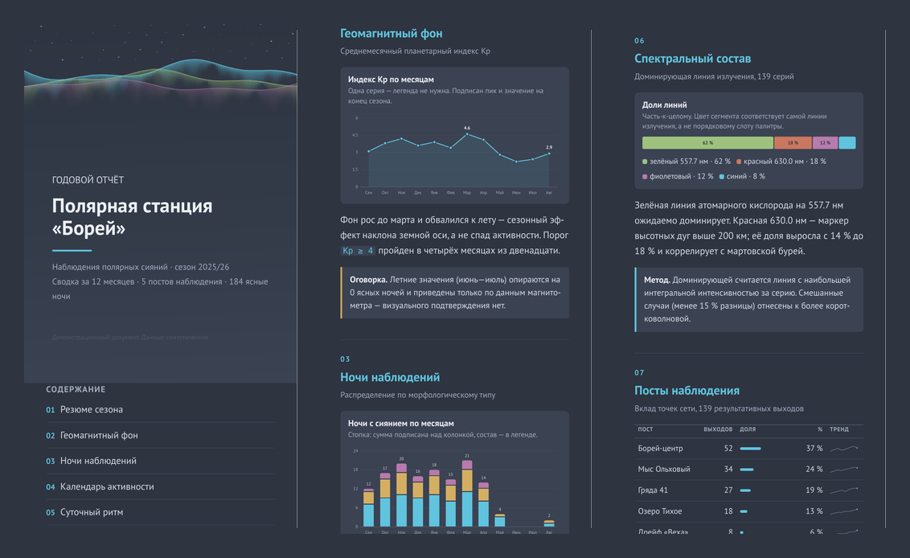
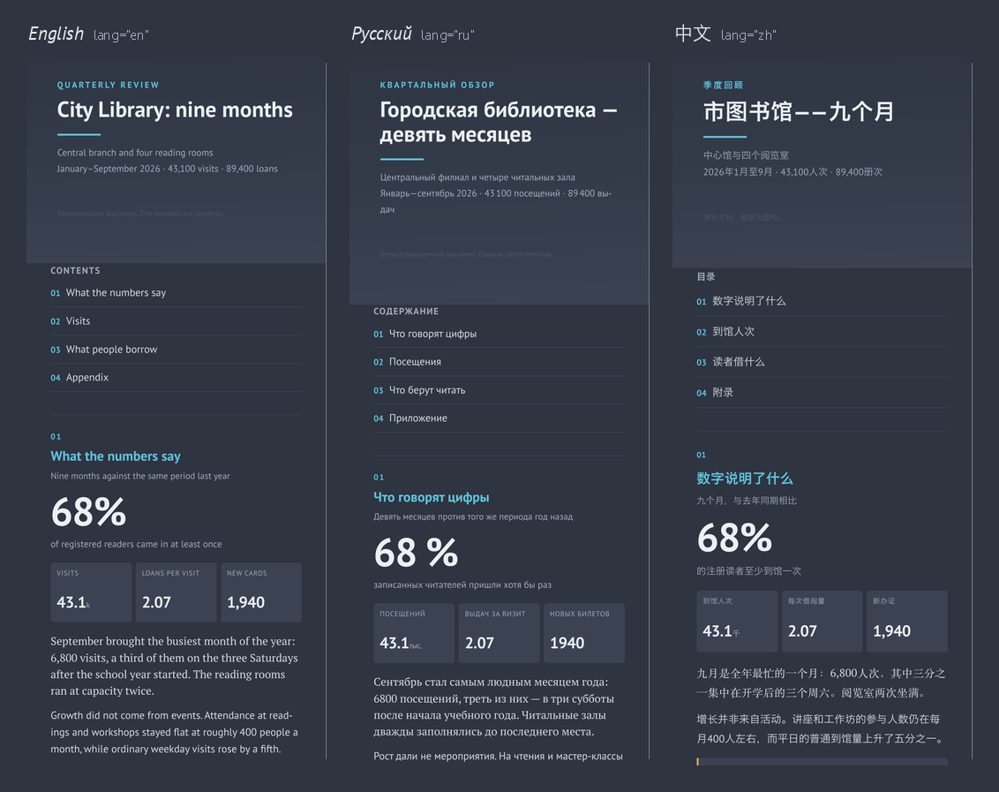

<p align="center">
  
</p>

<p align="center">
  <a href="skills/pdf-report/SKILL.md"></a>
  <a href="https://weasyprint.org/"></a>
  <a href="#language"></a>
</p>

<p align="center">
  <a href="https://claude.com/claude-code"></a>
  
  
  <a href="LICENSE"></a>
</p>

<p align="center">
  <strong>An agent skill that turns a report into a PDF people actually read on their phone.</strong><br>
  Dark Nord theme, one endless page instead of A4, charts drawn to spec — and it writes<br>
  in whatever language you asked in.<br>
  <a href="docs/examples/example-dark.pdf"><strong>Open the sample PDF →</strong></a>
</p>

## Language

The report speaks the language of the request. Same generator, same markup, same build —
what changes is the prose, `<html lang>`, the spacing around `%` and the typographic
conventions of that language. The decimal separator stays a period in all of them, on
purpose — a report is read next to code and tables, and one separator is one less ambiguity.

<p align="center">
  
</p>

| | English | Russian | Chinese |
|---|---|---|---|
| Sample | [demo-en.pdf](docs/examples/demo-en.pdf) | [demo-ru.pdf](docs/examples/demo-ru.pdf) | [demo-zh.pdf](docs/examples/demo-zh.pdf) |
| Decimal | `4.6` | `4.6` | `4.6` |
| Before `%` | none | non-breaking space | none |
| Quotes | "…" | «…» | 「…」 |
| Line breaking | hyphenation | hyphenation | `line-break:strict`, no hyphens |
| Humanizer | [blader/humanizer](https://github.com/blader/humanizer) | [ilyautov/humanizer-ru](https://github.com/ilyautov/humanizer-ru) | [op7418/Humanizer-zh](https://github.com/op7418/Humanizer-zh) |

Han characters fall back to PingFang / Noto Sans CJK / Source Han automatically; Latin and
Cyrillic stay on PT Sans and PT Serif. Any other language works too — it inherits the neutral
defaults (period, no space before `%`) and the structural rules of the English humanizer.

## About

Ask an agent for a PDF and you usually get A4 with Times New Roman, or an HTML file it calls a
report. This skill fixes the output end: WeasyPrint, a ready set of stylesheets, a chart module
with print-corrected geometry, and a build script with one sensible default.

The default is deliberate and it is not A4:

- **Dark Nord theme.** Reports get read on a phone, in the evening.
- **A scroll, not pages.** One page as long as the document needs, no page breaks at all.
  The height is found by binary search in `fit-scroll.py`. Past the PDF limit of 5080 mm the
  build falls back to a proper book layout with running heads and bookmarks.
- **136 mm at 13.5 pt.** Tuned by rendering into a real phone width (390 px), not by eye:
  ~13.7 px of web text at 48 characters per line.
- **One file.** Not a light version and a dark one, not A4 and mobile — one PDF.

Flags exist for the rest: `--light`, `--a4`, `--a5`, `--book`, `--both`.

## Install

```bash
# the skill itself
git clone https://github.com/GregoryKogan/pdf-report-skill.git
cp -R pdf-report-skill/skills/pdf-report ~/.claude/skills/pdf-report

# the engine
brew install weasyprint poppler qpdf            # macOS
# pip install weasyprint && sudo apt install poppler-utils qpdf   # Linux

# the humanizer for the language you write in (required by the skill)
git clone --depth 1 https://github.com/blader/humanizer ~/.claude/skills/humanizer
```

Codex, Cursor, Gemini CLI and OpenCode read `~/.agents/skills/` as well — the skill is plain
Markdown plus scripts, nothing Claude-specific. In this repository `.claude/skills` is a
symlink to `skills/`, so the repo itself works as a skills directory when cloned in place.

## Use

Ask for it in words — "make me a PDF report on X", «собери отчёт в pdf», «做成 PDF» — and the
agent follows `SKILL.md`. To drive the pipeline by hand:

```bash
skills/pdf-report/scripts/build.sh report.html out/     # -> out/report.pdf
skills/pdf-report/scripts/check.sh  out/report.pdf      # metadata, fonts, bookmarks, PNGs
skills/pdf-report/scripts/prose-check.sh out/report.pdf # machine-writing candidates
python3 examples/demo.py zh > demo-zh.html              # the trilingual sample
```

`check.sh` exports every page as a PNG next to the PDF. Looking at them is part of the
procedure, not an optional extra: on the sample report that pass caught 13 defects no
automated check finds — timeline events out of order, a legend spilling outside its SVG,
"empty" calendar cells that turned out invisible.

## What's in the box

| Path | What it is |
|---|---|
| [`skills/pdf-report/SKILL.md`](skills/pdf-report/SKILL.md) | the procedure the agent follows |
| [`references/markup.md`](skills/pdf-report/references/markup.md) | every class `base.css` understands |
| [`references/charts.md`](skills/pdf-report/references/charts.md) | the chart API and the print corrections |
| [`references/gotchas.md`](skills/pdf-report/references/gotchas.md) | 20 WeasyPrint traps, each with its fix |
| [`assets/charts.py`](skills/pdf-report/assets/charts.py) | area+line, stacked columns, heatmap, polar rose, 100 % bar, sparkline, scatter, multi-line, treemap, horizontal bars |
| `assets/*.css` | structure, two themes, four formats |
| [`scripts/`](skills/pdf-report/scripts) | build, fit-scroll, check, prose-check |
| [`examples/demo.py`](examples/demo.py) | one report in three languages |
| [`docs/examples/`](docs/examples) | the built PDFs |

Charts are drawn as inline SVG with presentation attributes — CSS does not cascade into inline
SVG, and a PDF has no hover, so every value is also reachable from a label, an axis or the
summary table in the appendix. The palette is Nord with chroma raised to the accessibility
floor: worst pair ΔE 18.8 for normal vision, 11.7 under colour-vision deficiency.

## Requirements

WeasyPrint 69, Poppler (`pdfinfo`, `pdftoppm`, `pdftotext`, `pdffonts`), qpdf, Python 3.9+,
bash. macOS and Linux. `build.sh` finds a Python that can `import weasyprint` on its own;
point `PDFREPORT_PYTHON` at a specific one if you keep it somewhere unusual.

PT Sans, PT Serif and Menlo come from the system on macOS; on Linux install
`fonts-pt-sans` (or any substitute — the stacks degrade gracefully) and `fonts-noto-cjk`
if you write in Chinese, Japanese or Korean.

## License

[MIT](LICENSE). Copyright Gregory Koganovsky.

The bundled sample report (`assets/example-dark.html`, Russian) and the three demos are
synthetic: a fictional polar station and a fictional city library. Any resemblance to real
aurora statistics is a coincidence.
